# Basic shape elements.

## `<line>` shape

The `<line>` SVG element is an SVG basic shape used to create a line connecting two points.

<dl>
<dt>&ensp;<kbd>x1</kbd></dt><dd>
  
  Defines the x-axis coordinate of the line **starting point**.<br>
  *Default* value: `0`.
  
</dd>
<dt>&ensp;<kbd>y1</kbd></dt><dd>
  
  Defines the y-axis coordinate of the line **starting point**.<br>
  *Default* value: `0`.
  
</dd>
<dt>&ensp;<kbd>x2</kbd></dt><dd>
  
  Defines the x-axis coordinate of the line **ending point**.<br>
  *Default* value: `0`.
  
</dd>
<dt>&ensp;<kbd>y2</kbd></dt><dd>
  
  Defines the y-axis coordinate of the line **ending point**.<br>
  *Default* value: `0`.
  
</dd>
</dl>

<table><tr><td>

```svg
<!-- If you do not specify the stroke
       color the line will not be visible -->
<line x1="20" y1="20"  x2="40" y2="100" stroke="black" />
```

</td><td>

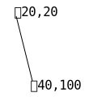

</td></tr></table>


### `stroke-linecap` for dashed lines.

The `stroke-linecap` attribute defines the shape to be used at the end of open subpaths when they are stroked.<br>

</dd>
</dl>

<table><tr><td>

```svg
<defs>
  <g id="thick">
    <line y1="10" y2="10"  x2="145"
          stroke-width="20" stroke-opacity="0.5"
          stroke-dashoffset="-15"
          stroke-dasharray="20, 30,  40, 20" />
  </g>
</defs>

<!-- default stroke-linecap "butt" -->
<use href="#thick"  y= "0"  stroke="red" />

<!-- stroke-linecap affects each dash separately -->

<use href="#thick"  y="30"  stroke="green"
     stroke-linecap="round" />

<use href="#thick"  y="60"  stroke="blue"
     stroke-linecap="square" />
```

</td><td>

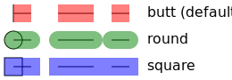

</td></tr></table>


## `<rect>` shape

The `<rect>` element is a basic shape that draws rectangles, defined by their **position**, **width**, and **height**.<br>
The rectangles may have their corners rounded.

<dl>
<dt>&ensp;<kbd>x</kbd></dt><dd>
  
  The `x` coordinate of the rect.<br>
  *Default* value: `0`.
  
</dd>
<dt>&ensp;<kbd>y</kbd></dt><dd>
  
  The `y` coordinate of the rect.<br>
  *Default* value: `0`.
  
</dd>
<dt>&ensp;<kbd>width</kbd></dt><dd>
  
  The **width** of the rect.
  
</dd>
<dt>&ensp;<kbd>height</kbd></dt><dd>
  
  The **height** of the rect.
  
</dd>
<dt>&ensp;<kbd>rx</kbd></dt><dd>
  
  The **horizontal** corner **radius** of the rect.<br>
  Defaults to `ry` if it is specified.
  
</dd>
<dt>&ensp;<kbd>ry</kbd></dt><dd>
  
  The **vertical** corner **radius** of the rect.<br>
  Defaults to `rx` if it is specified.
  
</dd>
</dl>

*Default* `stroke` is `none`.<br>
*Default* `fill` is `black`.

<table><tr><td>

```svg
<!-- The stroke is a line centered on the edge of the fill -->
<!-- Notice the stroke and fill overlap,
     which doubles the opacity when overlapping -->

<rect x="0" y="0" width="100" height="70"
  stroke="red"
  stroke-width="6"
  stroke-opacity="0.5"
  stroke-dasharray="15 5"
  stroke-dashoffset="7.5"
fill="green"
/>
```

</td><td>

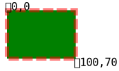

</td></tr></table>

### Rounding corners.

<table><tr><td>

```svg
<rect x="0" y="0"
    width="170" height="140"
    rx="20" ry="40"
    stroke="black"
    fill="none"
/>
```

</td><td>

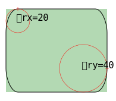

</td></tr></table>


## `<circle>` shape


The `<circle>` element is an basic shape, used to draw circles based on a center point and a **radius**.

<dl>
<dt>&ensp;<kbd>cx</kbd></dt><dd>
  
  The x-axis coordinate of the **center** of the circle.<br>
  *Default* value: `0`.
  
</dd>
<dt>&ensp;<kbd>cy</kbd></dt><dd>
  
  The y-axis coordinate of the **center** of the circle.<br>
  *Default* value: `0`.
  
</dd>
<dt>&ensp;<kbd>r</kbd></dt><dd>
  
  The radius of the circle. A value lower or equal to `0` disables rendering of the circle.
  *Default* value: `0`.
  
</dd>
</dl>

*Default* `stroke` is `none`.<br>
*Default* `fill` is `black`.

<table><tr><td>

```svg
<circle cx="100" cy="100" r="60"
    stroke="greenyellow"
    stroke-width="6"
    stroke-opacity="0.5"
    stroke-dasharray="25 6.42"

    fill="blue"
    fill-opacity="0.5" 
/>
```

</td><td>

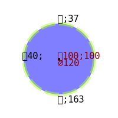

</td></tr></table>


## `<ellipse>` shape


The `<ellipse>` element is an basic shape, used to create ellipses based on a **center** coordinate, and both their `x` and `y` **radius**.

<dl>
<dt>&ensp;<kbd>cx</kbd></dt><dd>
  
  The `x` position of the **center** of the ellipse.<br>
  *Default* value: `0`.
  
</dd>
<dt>&ensp;<kbd>cy</kbd></dt><dd>
  
  The `y` position of the **center** of the ellipse.<br>
  *Default* value: `0`.
  
</dd>
<dt>&ensp;<kbd>rx</kbd></dt><dd>
  
  The **radius** of the ellipse on the `x` axis.
  
</dd>
<dt>&ensp;<kbd>ry</kbd></dt><dd>
  
  The **radius** of the ellipse on the `y` axis.
  
</dd>
</dl>

*Default* `stroke` is `none`.<br>
*Default* `fill` is `black`.

<table><tr><td>

```svg
<ellipse cx="100"  cy="100"
    rx="80"  ry="60"

    stroke="greenyellow"
    stroke-width="6"
    stroke-opacity="0.5"
    stroke-dasharray="25 6.42"

    fill="blue"
    fill-opacity="0.5" 
/>
```

</td><td>

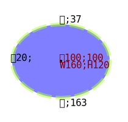

</td></tr></table>


## `<polyline>`, `<polygon>` shapes


The `<polyline>` element is an basic shape that creates straight **lines** connecting several points. Typically a polyline is used to create open shapes as the last point doesn't have to be connected to the first point.<br>
For **closed shapes** see the `<polygon>` element.

The `<polygon>` element defines a closed shape consisting of a set of connected straight **line** segments. The last point is connected to the first point.

<dl>
<dt>&ensp;<kbd>points</kbd></dt><dd>
  
  This attribute defines the **list of points** (pairs of `x`,`y` absolute coordinates) required to draw the polyline.<br>
  *Default* value: `""`
  
</dd>
</dl>

<table><tr><td>

```svg
<polyline points="10,40  125,25  45,90  75,10" 
    stroke="blueviolet"
    stroke-width="10"  stroke-opacity="0.6"
    stroke-linecap="round"
    stroke-linejoin="miter"
    fill="darkred"  fill-opacity="0.75"
/>
```

</td><td>

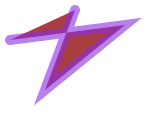

</td></tr></table>


## `<path>` shape


The `<path>` element is the generic element to define a shape. All the basic shapes can be created with a path element.

<dl>
<dt>&ensp;<kbd>d</kbd></dt><dd>
  
  This attribute defines the shape of the path.<br>
  *Default* value: `none`.
  
</dd>
</dl>

<dl>
<dt><h3>&emsp;Path commands</h3></dt><dd>

A path definition is a list of path commands where each command is composed of a command letter and numbers that represent the command parameters.

 - [MoveTo](#moveto-path-commands): `M`, `m`
 - [LineTo](#lineto-path-commands): `L`, `l`, `H`, `h`, `V`, `v`
 - [Cubic Bézier curve](#cubic-bézier-curve): `C`, `c`, `S`, `s`
 - [Quadratic Bézier curve](#quadratic-bézier-curve): `Q`, `q`, `T`, `t`
 - [Elliptical arc curve](#elliptical-arc-curve): `A`, `a`
 - [ClosePath](#close-path): `Z`, `z`

</dd>
</dl>


### *MoveTo* path commands

*MoveTo* instructions can be thought of as picking up the drawing instrument, and setting it down somewhere else-in other words, moving the current point $(P_o: \{x_o,\ y_o\})$.
There is no line drawn between $P_o$ and the new current point $(P_n: \{x_n,\ y_n\})$.


 Command | Parameters  | Notes
-------- | ----------- | ------
 `M`     | $(x,\ y)+$   | Move the current point to the coordinate $x,y$. Any subsequent coordinate pair(s) are interpreted as parameter(s) for implicit absolute *LineTo* (`L`) command(s).<br>Formula: $P_n = \{x,\ y\}$.
 `m`     | $(dx,\ dy)+$ |  Move the current point by shifting the last known position of the path by $dx$ along the x-axis and by dy along the y-axis. Any subsequent coordinate pair(s) are interpreted as parameter(s) for implicit relative *LineTo* (`l`) command(s).<br>Formula: $P_n = \{x_o + dx,\ y_o + dy\}$.


<table><tr><td>

```svg
<path
    stroke="red" stroke-width="4"
    fill="green"

    d="M 10,10  v    50  h 50
       m 10, 0  l 0,-50  l 50,50"
/>
```

</td><td>

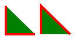

</td></tr></table>


### *LineTo* path commands

*LineTo* instructions draw a straight line from the current point $(P_o: \{x_o,\ y_o\})$ to the end point $(P_n: \{x_n,\ y_n\})$, based on the parameters specified. The end point $(P_n)$ then becomes the current point for the next command $(P_o')$.

 Command | Parameters   | Notes
-------- | ------------ | ------
 `L`     | $(x,\ y)+$    | Draw a **line** from the current point to the end point specified by $x,y$.   Any subsequent coordinate pair(s) are interpreted as parameter(s) for implicit absolute *LineTo* (`L`) command(s).<br><br>Formula: $P_o' = P_n = \{x,\ y\}$
 `l`     | $(dx,\ dy)+$  | Draw a **line** from the current point to the end point, which is the current point shifted by $dx$ along the x-axis and $dy$ along the y-axis.   Any subsequent coordinate pair(s) are interpreted as parameter(s) for implicit relative *LineTo* (`l`) command(s).<br><br>Formula: $P_o' = P_n = \{x_o + dx,\ y_o + dy\}$
 `H`     | $x+$         | Draw a **horizontal line** from the current point to the end point, which is specified by the $x$ parameter and the current point's $y$ coordinate.   Any subsequent value(s) are interpreted as parameter(s) for implicit absolute horizontal *LineTo* (`H`) command(s).<br><br>Formula: $P_o' = P_n = \{x,\ y_o\}$
 `h`     | $dx+$        | Draw a **horizontal line** from the current point to the end point, which is specified by the current point shifted by $dx$ along the x-axis and the current point's $y$ coordinate.   Any subsequent value(s) are interpreted as parameter(s) for implicit relative horizontal *LineTo* (`h`) command(s).<br><br>Formula: $P_o' = P_n = \{x_o + dx,\ y_o\}$
 `V`     | $y+$         | Draw a **vertical line** from the current point to the end point, which is specified by the $y$ parameter and the current point's $x$ coordinate.   Any subsequent values are interpreted as parameters for implicit absolute vertical *LineTo* (`V`) command(s).<br><br>Formula: $P_o' = P_n = \{x_o,\ y\}$
 `v`     | $dy+$        | Draw a **vertical line** from the current point to the end point, which is specified by the current point shifted by $dy$ along the y-axis and the current point's $x$ coordinate.   Any subsequent value(s) are interpreted as parameter(s) for implicit relative vertical *LineTo* (`v`) command(s).<br><br>Formula: $P_o' = P_n = \{x_o,\ y_o + dy\}$


### Cubic Bézier curve

Cubic Bézier curves are smooth curve definitions using four points:

<dl>
<dt>&ensp;starting point (current point):</dt><dd>
  
  $(P_o = \{x_o,\ y_o\})$
  
</dd>
<dt>&ensp;end point:</dt><dd>
  
  $(P_n = \{x_n,\ y_n\})$
  
</dd>
<dt>&ensp;start control point:</dt><dd>
  
  $(P_{CS} = \{x_{S},\ y_{S}\})$ (controls curvature near the start of the curve)
  
</dd>
<dt>&ensp;end control point:</dt><dd>
  
  $(P_{CE} = \{x_{E},\ y_{E}\})$ (controls curvature near the end of the curve)
  
</dd>
</dl>

After drawing, the end point ($P_n$) becomes the current point for the next command ($P_o'$).

 Command | Parameters                       | Notes
-------- | -------------------------------- | ------
 `C`     | $(x_S,\ y_S\quad x_E,\ y_E\quad x,\ y)+$       |  Draw a **cubic Bézier curve** from the **current point** to the **end point** specified by $x,\ y$.   The **start control point** is specified by $x_S,\ y_S$ and the **end control point** is specified by $x_E,\ y_E$.<br>   Any subsequent triplet(s) of coordinate pairs are interpreted as parameter(s) for implicit absolute cubic Bézier curve (`C`) command(s).
 `c`     | $(dx_S,\ dy_S\quad dx_E,\ dy_E\quad dx,\ dy)+$ | Draw a **cubic Bézier curve** from the **current point** to the **end point**, which is the current point **shifted** by $dx$ along the x-axis and $dy$ along the y-axis.   The **start control point** is the current point (starting point of the curve) **shifted** by $dx_S$ along the x-axis and $dy_S$ along the y-axis.   The **end control point** is the current point (starting point of the curve) **shifted** by $dx_E$ along the x-axis and $dy_E$ along the y-axis.<br>   Any subsequent triplet(s) of coordinate pairs are interpreted as parameter(s) for implicit relative cubic Bézier curve (`c`) command(s).<br><br>  Formulae:<br>  $P_o' = P_n = \{x_o + dx,\ \ y_o + dy\}$ ;<br>  $P_{CS} = \{x_o + dx_S,\ \ y_o + dy_S\}$ ;<br>  $P_{CE} = \{x_o + dx_E,\ \ y_o + dy_E\}$
 `S`     | $(x_E,\ y_E\quad x,\ y)+$               |  Draw a **smooth cubic Bézier curve** from the **current point** to the **end point** specified by $x,\ y$. The **end control point** is specified by $x_E,\ y_E$.   The **start control point** is the **reflection** of the end control point of the previous curve command about the current point.<br>   If the previous command wasn't a cubic Bézier curve, the start control point is the same as the curve starting point (current point).   Any subsequent pair(s) of coordinate pairs are interpreted as parameter(s) for implicit absolute smooth cubic Bézier curve (`S`) commands.
 `s`     | $(dx_E,\ dy_E\quad dx,\ dy)+$          |  Draw a **smooth cubic Bézier curve** from the **current point** to the **end point**, which is the current point **shifted** by $dx$ along the x-axis and $dy$ along the y-axis.   The **end control point** is the current point (starting point of the curve) **shifted** by $dx_E$ along the x-axis and $dy_E$ along the y-axis.   The **start control point** is the **reflection** of the end control point of the previous curve command about the current point.<br>   If the previous command wasn't a cubic Bézier curve, the start control point is the same as the curve starting point (current point).   Any subsequent pair(s) of coordinate pairs are interpreted as parameter(s) for implicit relative smooth cubic Bézier curve (`s`) commands. 


<table><tr><td>

```svg
<path d="M  0.0,  0.0
         C 27.6,  0.0    50.0, 22.4    50, 50
         c  0.0, 27.6   -22.4, 50.0   -50, 50
        "
    stroke="red" stroke-width="6"  fill="none"
/>
```

</td><td>

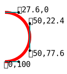

</td></tr></table>


<table><tr><td>

```svg
<path d="M  0, 90
         C 30, 90  25, 10  50, 10
         S         70, 90  90, 90
        "
    stroke="red" stroke-width="6"  fill="none"
/>
```

</td><td>

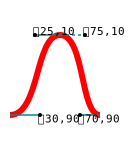

</td></tr></table>


### Quadratic Bézier curve

Quadratic Bézier curves are smooth curve definitions using three points:

<dl>
<dt>&ensp;starting point (current point):</dt><dd>
  
  $(P_o = \{x_o,\  y_o\})$
  
</dd>
<dt>&ensp;end point:</dt><dd>
  
  $(P_n = \{x_n,\  y_n\})$
  
</dd>
<dt>&ensp;control point:</dt><dd>
  
  $(P_c = \{x_c,\  y_c\})$ (controls curvature)
  
</dd>
</dl>

After drawing, the end point ($P_n$) becomes the current point for the next command ($P_o'$).

 Command | Parameters                       | Notes
-------- | -------------------------------- | ------
 `Q`     | $(x_c,\ y_c\quad x,\ y)+$       |  Draw a **quadratic Bézier curve** from the **current point** to the **end point** specified by $x,\ y$.   The **control point** is specified by $x_c,\ y_c$.<br>   Any subsequent pair(s) of coordinate pairs are interpreted as parameter(s) for implicit absolute quadratic Bézier curve (`Q`) command(s).<br><br>  Formulae:<br>  $P_o' = P_n = \{x,\ \ y\}$ ;<br>  $P_c = \{x_c,\ \ y_c\}$
 `q`     | $(dx_c,\ dy_c\quad dx,\ dy)+$       |  Draw a **quadratic Bézier curve** from the **current point** to the **end point**, which is the current point **shifted** by $dx$ along the x-axis and $dy$ along the y-axis.   The **control point** is the current point (starting point of the curve) **shifted** by $dx_c$ along the x-axis and $dy_c$ along the y-axis.<br>   Any subsequent pair(s) of coordinate pairs are interpreted as parameter(s) for implicit relative quadratic Bézier curve (`q`) command(s).<br><br>  Formulae:<br>  $P_o' = P_n = \{x_o + dx,\ \ y_o + dy\}$ ;<br>  $P_c = \{x_o + dx_c,\ \ y_o + dy_c\}$
 `T`     | $(x,\ y)+$       |  Draw a **smooth quadratic Bézier curve** from the **current point** to the **end point** specified by $x,\ y$.   The **control point** is the **reflection** of the control point of the previous curve command about the current point.<br>   If the previous command wasn't a quadratic Bézier curve, the control point is the same as the curve starting point (current point).   Any subsequent coordinate pair(s) are interpreted as parameter(s) for implicit absolute smooth quadratic Bézier curve (`T`) command(s).<br><br>  Formulae:<br>  $P_o' = P_n = \{x,\ \ y\}$
 `t`     | $(dx,\ dy)+$       |  Draw a **smooth quadratic Bézier curve** from the **current point** to the **end point**, which is the current point **shifted** by $dx$ along the x-axis and $dy$ along the y-axis.   The **control point** is the **reflection** of the control point of the previous curve command about the current point.<br>   If the previous command wasn't a quadratic Bézier curve, the control point is the same as the curve starting point (current point).   Any subsequent coordinate pair(s) are interpreted as parameter(s) for implicit relative smooth quadratic Bézier curve (`t`) command(s).<br><br>  Formulae:<br>  $P_o' = P_n = \{x_o + dx,\ \  y_o + dy\}$


<table><tr><td>

```svg
<path d="M            0,  0
         q 40, -80   80,  0
         T          160, 40
        "
    stroke="darkmagenta" stroke-width="6"  fill="none"
/>
```

</td><td>

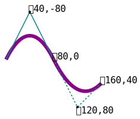

</td></tr></table>


### Elliptical arc curve

Elliptical arc curves are curves defined as a portion of an ellipse.   It is sometimes easier to draw highly regular curves with an elliptical arc than with a Bézier curve.

 Command | Parameters                       | Notes
-------- | -------------------------------- | ------
 `A`     | $(r_x\ \ r_y\quad \mathrm{angle}\quad \mathrm{largeArcFlag}\quad \mathrm{sweepFlag}\quad x\ \ y)+$       |  Draw an **Arc curve** from the current point to the coordinate $x,\ y$.   The center of the ellipse used to draw the arc is determined automatically based on the other parameters of the command:<br> • $r_x$ and $r_y$ are the two **radii** of the ellipse ;<br> • $\mathrm{'angle'}$ represents a **rotation** (in **degrees**) of the ellipse relative to the **x-axis** ;<br> • $\mathrm{'llargeArcFlag'}$ and $\mathrm{'sweepFlag'}$ allows to choose which arc must be drawn as 4 possible arcs can be drawn out of the other parameters.<br> • $\mathrm{'largeArcFlag'}$ allows to choose one of the **large arc** (`1`) or **small arc** (`0`),<br> • $\mathrm{'sweepFlag'}$ allows to choose one of the **clockwise turning arc** (`1`) or **counterclockwise turning arc** (`0`)<br><br>The coordinate $x,\ y$ becomes the new current point for the next command.   All subsequent sets of parameters are considered implicit absolute arc curve (`A`) commands.
 `a`     | $(r_x\ \ r_y\quad \mathrm{angle}\quad \mathrm{largeArcFlag} \quad \mathrm{sweepFlag}\quad dx\ \ dy)+$       |  Draw an **Arc curve** from the current point to a point for which **coordinates** are those of the current point **shifted** by $dx$ along the x-axis and $dy$ along the y-axis.   The center of the ellipse used to draw the arc is determined automatically based on the other parameters of the command:<br> • $r_x$ and $r_y$ are the two **radii** of the ellipse;<br> • $\mathrm{'angle'}$ represents a **rotation** (in **degrees**) of the ellipse relative to the **x-axis**;<br> • $\mathrm{'largeArcFlag'}$ and $\mathrm{'sweepFlag'}$ allows to choose which arc must be drawn as 4 possible arcs can be drawn out of the other parameters.<br> • $\mathrm{'largeArcFlag'}$ allows a choice of **large arc** (`1`) or **small arc** (`0`),<br> • $\mathrm{'sweepFlag'}$ allows a choice of a **clockwise arc** (`1`) or **counterclockwise arc** (`0`)<br><br>The current point gets its X and Y coordinates shifted by $dx$ and $dy$ for the next command.   All subsequent sets of parameters are considered implicit relative arc curve (`a`) commands. 


<table><tr><td>

```svg
<!-- A  rx  ry  angle  large-arc-flag  sweep-flag  x  y -->
<!-- Arc curve from the current point to the coordinate `x`, `y`
     `rx` and `ry` are the two radii of the ellipse
     `angle` represents a rotation[°] of the ellipse relative to the x-axis
     `large-arc-flag` - the large arc(1) or small arc(0)
     `sweep-flag` - the clockwise turning arc(1) or counterclockwise(0) -->
<g transform="translate(65,65)" fill="none" stroke-width="6">
    <path d="M 100,0  a 100 100  666  1 0  -100 100"  stroke="red"   />
    <path d="M 100,0  a 100 100  666  0 0  -100 100"  stroke="green" />
    <path d="M 100,0  a 100 100  666  0 1  -100 100"  stroke="blue"  />
</g>
```

</td><td>

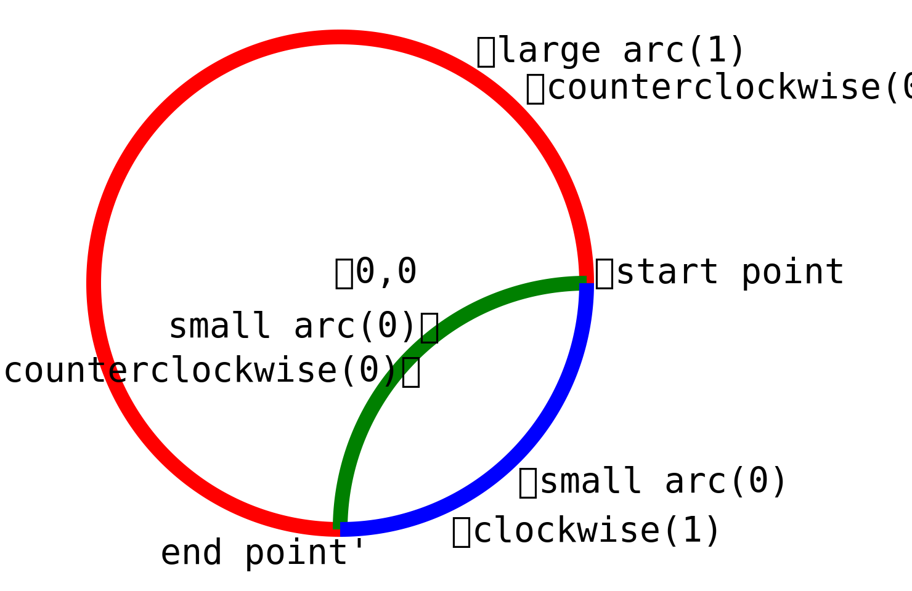

</td></tr></table>


<table><tr><td>

```svg
<!-- A  rx  ry  angle  large-arc-flag  sweep-flag  x  y -->
<!-- Arc curve from the current point to the coordinate `x`, `y`
     `rx` and `ry` are the two radii of the ellipse
     `angle` represents a rotation[°] of the ellipse relative to the x-axis
     `large-arc-flag` - the large arc(1) or small arc(0)
     `sweep-flag` - the clockwise turning arc(1) or counterclockwise(0) -->
<g transform="translate(80,170)"  fill="none" stroke-width="6">
    <path d="M 0,0  a 100 150   0  1 1  100 150"  stroke="red"  />
    <path d="M 0,0  a 100 150  90  1 1  100 150"  stroke="blue" />
</g>
```

</td><td>

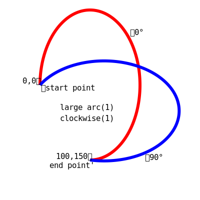

</td></tr></table>


### Close path

*ClosePath* instructions draw a **straight line** from the current position to the first point in the path.

<dl>
<dt>&ensp;<kbd>Z</kbd>, <kbd>z</kbd>:</dt><dd>
  
  Close the current subpath by connecting the last point of the path with its initial point.   If the two points are at different coordinates, a straight line is drawn between those two points.

</dd>
</dl>
