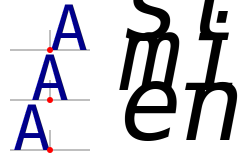
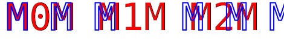
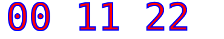

# Texting in SVG.

## Font properties.

You can use following attributes with the following SVG elements:
 - `<text>`
 - `<textPath>`
 - `<tspan>`


### `font-family`

The `font-family` attribute indicates which font **family** will be used to render the text, specified as a prioritized list of font family names and/or generic family names.

Example values:
 - `"Arial, Helvetica, sans-serif"`
 - `"Consolas"`


### `font-size`
  
The `font-size` attribute refers to the **size** of the font from baseline to baseline when multiple lines of text are set solid in a multiline layout environment.

*Default* value: `"medium"`

Example values:
 - `"smaller"`
 - `"11.75210406pt"`

<mark> TBD: Font size and line height </mark>


### `font-style`

The `font-style` attribute specifies whether the text is to be rendered using a **`normal`**, **`italic`**, or **`oblique`** face.

Posible values:
 - `"normal"` (*default*)
 - `"italic"`
 - `"oblique"`


### `font-variant`

The `font-variant` attribute indicates whether the text is to be rendered using **variations** of the font's glyphs.

Posible values:
 - `"normal"`  (*default*)
 - `"small-caps"`
 - `"all-small-caps"`
 - `"petite-caps"`
 - `"all-petite-caps"`
 - `"unicase"`
 - `"titling-caps"`


### `font-weight`

The `font-weight` attribute refers to the **boldness** or **lightness** of the glyphs used to render the text, relative to other fonts in the same font family.

Posible values:
 - `"normal"`  (*default*)
 - `"bold"`
 - `"bolder"`
 - `"lighter"`


## CSS font properties.

```svg
<svg xmlns="http://www.w3.org/2000/svg"
     xmlns:xlink="http://www.w3.org/1999/xlink" >
    <style>
        text {
            font: italic small-caps bold 12pt Consolas;
        }
        .thin {
            font-stretch: condensed;
            font-weight: lighter;
        }
    </style>

    <text class="thin">Modified text</text>
</svg>
```

### [`font-stretch`](https://developer.mozilla.org/en-US/docs/Web/CSS/Reference/Properties/font-stretch)

 - `normal` <br>
    &emsp;Specifies a normal font face.
 - `semi-condensed`, `condensed`, `extra-condensed`, `ultra-condensed` <br>
    &emsp;Specifies a more **condensed** font face than normal, with ultra-condensed as the most condensed.
 - `semi-expanded`, `expanded`, `extra-expanded`, `ultra-expanded` <br>
    &emsp;Specifies a more expanded font face than normal, with ultra-expanded as the most expanded.
 - \<percentage> <br>
    &emsp;A <percentage> value between `50%` and `200%` (inclusive). Negative values are not allowed for this property.

 Keyword           | Percentage
------------------ | -----------
 `ultra-condensed` | `50%`
 `extra-condensed` | `62.5%`
 `condensed`       | `75%`
 `semi-condensed`  | `87.5%`
 `normal`          | `100%`
 `semi-expanded`   | `112.5%`
 `expanded`        | `125%`
 `extra-expanded`  | `150%`
 `ultra-expanded`  | `200%`


### [font-weight](https://developer.mozilla.org/en-US/docs/Web/CSS/Reference/Properties/font-weight)

 - `lighter`
 - `normal`
 - `bold`
 - `bolder`
 - \<number>
 
    A \<number> value between 1 and 1000, both values included. Higher numbers represent weights that are bolder than (or as bold as) lower numbers. This allows fine-grain control for variable fonts. For non-variable fonts, if the exact specified weight is unavailable, a fallback weight algorithm is used — numeric values that are divisible by 100 correspond to common weight names, as described in the Common weight name mapping section below.

 Value  | Common weight name
------- | -----------
 `100`  | Thin (Hairline)
 `200`  | Extra Light (Ultra Light)
 `300`  | Light
 `400`  | Normal (Regular)
 `500`  | Medium
 `600`  | Semi Bold (Demi Bold)
 `700`  | Bold
 `800`  | Extra Bold (Ultra Bold)
 `900`  | Black (Heavy)
 `950`  | Extra Black (Ultra Black)


## [Stroke](visual-attributes.md#stroke-attributes) and [fill](visual-attributes.md#fill-attributes) attributes.

<table><tr><td>

```svg
<svg  font-size="47pt" font-family="Consolas" >
    <g transform="translate(10,50)"
      stroke-width="3"  stroke-opacity="0.5"
      fill-opacity="0.8" >

        <!-- Default:  stroke="none"  fill="black" -->
        <text x="0" y=  "0"
          stroke="none" fill="black" > Fill </text>
        <text x="0" y= "50"
          stroke="red" fill="none" > Stroke </text>
        <text x="0" y="100"
          stroke="red" fill="blue" > Fill_Stroke</text>
    </g>
</svg>
```

</td><td>


</td></tr></table>


## Text alignments.

### Shifting text position.

<dl>
<dt>&ensp;<kbd>dx</kbd></dt><dd>
  
  The `dx` attribute indicates a **shift** along the **x-axis** on the position of an element or its content.
  
</dd>
<dt>&ensp;<kbd>dy</kbd></dt><dd>
  
  The `dy` attribute indicates a **shift** along the **y-axis** on the position of an element or its content.
  
</dd>
</dl>


<table><tr><td>

```svg
<text                  > M </text>
<text dx="0.5019531em" > M </text>

<text          > x </text>
<text dy="1ex" > x </text>

<text                 > M </text>
<text dy="1.301793ex" > M </text>
```

</td><td>


</td></tr></table>


### `text-anchor`

The `text-anchor` attribute is used to align (start-, middle- or end-alignment) a string of pre-formatted text or auto-wrapped text where the wrapping area is determined from the [inline-size](https://developer.mozilla.org/en-US/docs/Web/CSS/Reference/Properties/inline-size) property relative to a given point.

The `text-anchor` attribute is applied to each individual text chunk within a given [`<text>` element](#text).   Each text chunk has an initial current text position, which represents the point in the user coordinate system resulting from (depending on context) application of the `x` and `y` attributes on the `<text>` element, any `x` or `y` attribute values on a [`<tspan>` element](#tspan) assigned explicitly to the first rendered character in a text chunk, or determination of the initial current text position for a [`<textPath>` element](#textPath).

Posible values:

<dl>
<dt>&ensp;<kbd>"start"</kbd> (<em>default</em>)</dt><dd>
  
  The rendered characters are aligned such that the start of the text string is at the initial current text position.  For an element with a direction property value of `ltr` (typical for most European languages), the left side of the text is rendered at the initial text position.  For an element with a direction property value of `rtl` (typical for Arabic and Hebrew), the right side of the text is rendered at the initial text position. For an element with a vertical primary text direction (often typical for Asian text), the top side of the text is rendered at the initial text position.
  
</dd>
<dt>&ensp;<kbd>"middle"</kbd></dt><dd>
  
  The rendered characters are aligned such that the middle of the text string is at the current text position.  (For text on a path, conceptually the text string is first laid out in a straight line.  The midpoint between the start of the text string and the end of the text string is determined.  Then, the text string is mapped onto the path with this midpoint placed at the current text position.)
  
</dd>
<dt>&ensp;<kbd>"end"</kbd></dt><dd>
  
  The rendered characters are shifted such that the end of the resulting rendered text (final current text position before applying the `text-anchor` property) is at the initial current text position.  For an element with a `direction` property value of `ltr` (typical for most European languages), the right side of the text is rendered at the initial text position.  For an element with a `direction` property value of `rtl` (typical for Arabic and Hebrew), the left side of the text is rendered at the initial text position.  For an element with a vertical primary text direction (often typical for Asian text), the bottom of the text is rendered at the initial text position.
  
</dd>
</dl>


<table><tr><td>

```svg
<text y=  "0"  text-anchor="start"  > A </text>
<text y= "50"  text-anchor="middle" > A </text>
<text y="100"  text-anchor="end"    > A </text>
```

</td><td>



</td></tr></table>


### Text direction.

<mark> TBD: </mark>
 - [writing-mode](https://developer.mozilla.org/en-US/docs/Web/SVG/Reference/Attribute/writing-mode)
 - [direction](https://developer.mozilla.org/en-US/docs/Web/SVG/Reference/Attribute/direction)
 - [unicode-bidi](https://developer.mozilla.org/en-US/docs/Web/SVG/Reference/Attribute/unicode-bidi)

```svg
    <!-- Vertical Text -->
    <circle cx="10" cy="80" r="0.5" />
    <text x="10" y="80" writing-mode="tb" class="smallfont" >TopBot</text>
    <circle cx="10" cy="80" r="0.5" />
    <text x="10" y="80"  class="smallfont" >Horiz</text>

    <!-- Text starting point and letter order
         right aligned and right to left letters order -->
    <circle cx="40" cy="90" r="0.5" />
    <text x="40" y="90" direction="rtl"                               class="smallfont" >123</text>
    <circle cx="40" cy="99.5" r="0.5" />
    <text x="40" y="100" direction="rtl" unicode-bidi="bidi-override" class="smallfont" >123</text>

```

## Text sizing.

### [Kerning](https://developer.mozilla.org/en-US/docs/Web/CSS/Reference/Properties/font-kerning), [letter](https://developer.mozilla.org/en-US/docs/Web/SVG/Reference/Attribute/letter-spacing) and [word](https://developer.mozilla.org/en-US/docs/Web/SVG/Reference/Attribute/word-spacing) spacing.

<dl>
<dt>&ensp;<kbd>letter-spacing</kbd></dt><dd>
  
  The **`letter-spacing`** attribute controls **spacing between text characters**.
  
  If the attribute value is a unitless number (like `128`), the browser processes it as a [`<length>`](https://developer.mozilla.org/en-US/docs/Web/CSS/Reference/Values/length) in the current user coordinate system.

  If the attribute value has a unit identifier, such as `.25em` or `1%`, then the browser converts the `<length>` into its corresponding value in the current user coordinate system.
  
</dd>
<dt>&ensp;<kbd>word-spacing</kbd></dt><dd>
  
  The **`word-spacing`** attribute specifies **spacing behavior between words**.
  
</dd>
</dl>

*Default* value: `"normal"`


<table><tr><td>

```svg
<text  fill="red" >
    M0M M1M M2M </text>
<!-- Letter spacing increased by
     the `horiz-adv-x` value.
     Note: ' ' character is also letter -->
<text fill="none" stroke="blue"
  letter-spacing="0.5498em"  >
    MMM MMM </text>
```

</td><td>



</td></tr></table>


<table><tr><td>

```svg
<text  fill="red" >
    00 11 22 </text>
<!-- Word spacing increased by
     the `horiz-adv-x` value. -->
<text fill="none" stroke="blue"
  word-spacing="0.5498em"  >
    00 11 22 </text>
```

</td><td>



</td></tr></table>


### Shrinking and stretching text.

<mark> TBD: </mark>
 - [lengthAdjust](https://developer.mozilla.org/en-US/docs/Web/SVG/Reference/Attribute/lengthAdjust)
 - [textLength](https://developer.mozilla.org/en-US/docs/Web/SVG/Reference/Attribute/textLength)

```svg
    <!-- Text length adjustment.
    Shrinking or stretching text. -->
    <text x="90" y="60"  fill="red" > A long long.</text>
    <text x="90" y="70"  fill="green"
        textLength="60" lengthAdjust="spacing" > A long long.</text>
    <text x="90" y="80"  fill="blue"
        textLength="60" lengthAdjust="spacingAndGlyphs"> A long long.</text> 
```


# Text elements.

## `<text>`

<mark> TBD: </mark>


## [`<tspan>`](https://developer.mozilla.org/en-US/docs/Web/SVG/Reference/Element/tspan)

<mark> TBD: </mark>

```svg
    <!-- tspan -->
    <text x="60" y="90"  class="smallfont" >
        <tspan>
            <a xlink:href="https://jenkov.com/tutorials/svg/tspan-element.html"
                xlink:show="new">
            tspan</a> Line<tspan baseline-shift="super">1</tspan>
        </tspan>
        <tspan x="60" dy="2ex" >
            tspan <tspan font-weight="bold">Line</tspan>2
        </tspan>
    </text>
```


## [`<textPath>`](https://developer.mozilla.org/en-US/docs/Web/SVG/Reference/Element/textPath)

<mark> TBD: </mark>

```svg
    <!-- textPath -->
    <defs> <path id="text_path" d="M 120, 100  q 50,0 50,-20" /> </defs>
    <use xlink:href="#text_path" stroke="darkmagenta"  fill="none" />
    <text class="smallfont">
        <textPath xlink:href="#text_path"
            startOffset="3em"
            lengthAdjust="spacing"
            textLength="5em"
        >
            text on path.
        </textPath>
    </text>
```


# Template

<table><tr><td>

```svg
<text x="10" dx="-1.65" y="20" fill="blue"> L10;20 </text>
```

</td><td>
<svg width="60"  height="120" style="background-color: white;">
    <text x= "20" y="100" dx="-0.182617em">˻20;</text>
    <text x="100" y= "37" dx="-0.182617em">˻;37</text>
</svg>
</td></tr></table>
