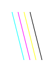
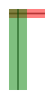
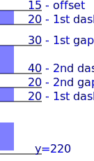
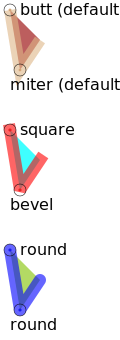
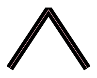
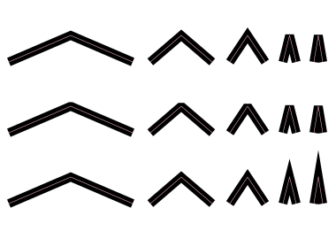

# Visual shape attributes

## Stroke attributes.

You can use these attributes with the following SVG elements:

 - `<circle>`
 - `<ellipse>`
 - `<path>`
 - `<line>`
 - `<polygon>`
 - `<polyline>`
 - `<rect>`
 - `<text>`
 - `<textPath>`
 - `<tspan>`

### Stroke color.

<dl>
<dt>&ensp;<kbd>stroke</kbd></dt><dd>
  
  The `stroke` attribute is a presentation attribute defining the **color** (or any SVG paint servers like gradients or patterns) used to paint the outline of the shape.
  
</dd>
</dl>

If you do not specify the `stroke` color for the **line** it will not be visible.

<table><tr><td>

```svg
<line x1="10" y1="20"  x2="30" y2="100" />
<line x1="20" y1="20"  x2="40" y2="100" stroke="cyan" />
<line x1="30" y1="20"  x2="50" y2="100" stroke="magenta" />
<line x1="40" y1="20"  x2="60" y2="100" stroke="#FFFF00" />
<line x1="50" y1="20"  x2="70" y2="100" stroke="#000000" />
```

</td><td>



</td></tr></table>


### Stroke width and opacity:

<dl>
<dt>&ensp;<kbd>stroke-width</kbd></dt><dd>
  
  The `stroke-width` attribute defines the **width** of the stroke to be applied to the shape.<br>
  It applies to any SVG shape or text-content element, but as an inherited property, it may be applied to elements such as `<g>` and still have the intended effect on descendant elements' strokes.
  
</dd>
<dt>&ensp;<kbd>stroke-opacity</kbd></dt><dd>
  
  The `stroke-opacity` attribute defines the **opacity** of the paint server (color, gradient, pattern, etc.) applied to the stroke of a shape.
  
</dd>
</dl>

<table><tr><td>

```svg
<line x1="10" y1="15"  x2="50" y2="15" stroke="black" />
<line x1="10" y1="15"  x2="50" y2="15"
  stroke="red"
  stroke-width="10"
  stroke-opacity="0.5" />

<line x1="20" y1="10"  x2="20" y2="100" stroke="black" />
<line x1="20" y1="10"  x2="20" y2="100"
  stroke="green"
  stroke-width="10"
  stroke-opacity="0.5" />
```

</td><td>



</td></tr></table>

**Scaling**: By default, stroke thickness scales with the SVG size.
To keep a consistent thickness regardless of scaling, use `vector-effect="non-scaling-stroke"`.


### Dashed stroke:

<dl>
<dt>&ensp;<kbd>stroke-dasharray</kbd></dt><dd>
  
  The `stroke-dasharray` attribute defines the pattern of dashes and gaps used to paint the outline of the shape.
  
</dd>
<dt>&ensp;<kbd>stroke-dashoffset</kbd></dt><dd>
  
  The `stroke-dashoffset` attribute defines an offset on the rendering of the associated dash array.
  
</dd>
</dl>

<table><tr><td>

```svg
<line x1="10" x2="10"  y2="220"
  stroke="blue" stroke-width="20" stroke-opacity="0.5"
  stroke-dashoffset="-15"
  stroke-dasharray="20, 30,  40, 20" />
```

</td><td>



</td></tr></table>


## Line attributes

You can use these attributes with the following SVG elements:

 - `<line>` (only `stroke-linecap`)
 - `<rect>` (not `stroke-linecap`)
 - `<polyline>`
 - `<polygon>` (not `stroke-linecap`)
 - `<path>`
 - `<text>`
 - `<textPath>`
 - `<tspan>`

### Line endings (`stroke-linecap`) and corners shapes (`stroke-linejoin`).

The `stroke-linecap` attribute defines the shape to be used at the **end of open subpaths** when they are stroked.

The `stroke-linejoin` attribute defines the shape to be used at the **corners of paths** when they are stroked.

#### `stroke-linecap` values:

 - `butt` (*default*)
 - `square`
 - `round`

#### `stroke-linejoin` values:

 - `miter` (*default*)
 - `bevel`
 - `round`


<table><tr><td>

```svg
<defs>
    <g id="shape">
        <path d="m 0,0  l 10,60  l 20,-30"
            stroke-width="12" 
            stroke-opacity="0.6"
            fill-opacity="0.75" />
    </g>
</defs>

<!-- default:
       stroke-linecap="butt"
       stroke-linejoin="miter" -->
<use href="#shape" x="10" y="10"
    stroke="burlywood" fill="brown" />

<use href="#shape" x="10" y="110"
    stroke="red" fill="aqua"
    stroke-linecap="square" 
    stroke-linejoin="bevel" />

<use href="#shape" x="10" y="210"
    stroke="blue" fill="yellowgreen"
    stroke-linecap="round"
    stroke-linejoin="round" />
```

</td><td>



</td></tr></table>


### Line joints miter limit ([`stroke-miterlimit`](https://developer.mozilla.org/en-US/docs/Web/SVG/Reference/Attribute/stroke-miterlimit)).

The `stroke-miterlimit` attribute definines a limit on the ratio of the miter length to the `stroke-width` used to draw a miter join.<br>
When the limit is exceeded, the join is converted from a miter to a bevel.

*Default* `stroke-miterlimit` is `4`.

When two line segments meet at a sharp angle and `miter` joins have been specified for `stroke-linejoin`, it is possible for the miter to extend far beyond the thickness of the line stroking the path. The `stroke-miterlimit` ratio is used to define when the limit is exceeded, if so the join is converted from a miter to a bevel.

The ratio of miter length (distance between the outer tip and the inner corner of the miter) to `stroke-width` is directly related to the angle (theta) between the segments in user space by the formula:

$$
  \mathrm{stroke\text{-}mitterlimit} =
  \frac{ \mathrm{miterLength} }{ \mathrm{stroke\text{-}width} } =
  \frac{ 1 }{ \sin(\frac{\theta}{2}) }
$$

For example, a miter limit of `1.414` converts miters to bevels for theta less than `90°`, a limit of `4.0` converts them for theta less than approximately `29°`, and a limit of `10.0` converts them for theta less than approximately `11.5°`.

<table><tr><td>

```svg
<path
    stroke="black"  fill="none" stroke-width="16"
    stroke-linejoin="miter"
    stroke-miterlimit="1"
    d="m 20,140  l 80,-120  l 80,120" />
```

</td><td>



</td></tr></table>

Example for `stroke-miterlimit` equal `4` (default), `1` and `8`.




## Fill attributes

### [`fill-rule`](https://developer.mozilla.org/en-US/docs/Web/SVG/Reference/Attribute/fill-rule)
